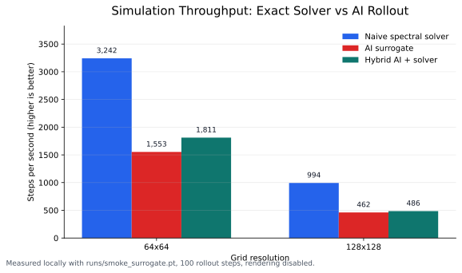
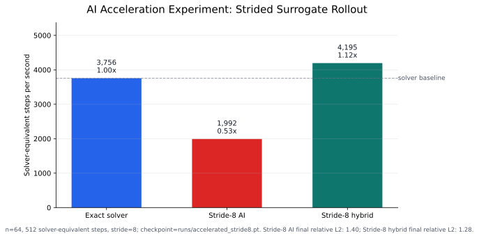
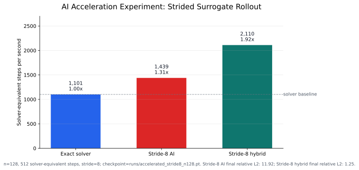
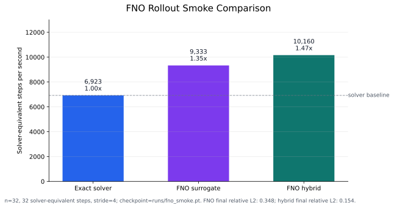
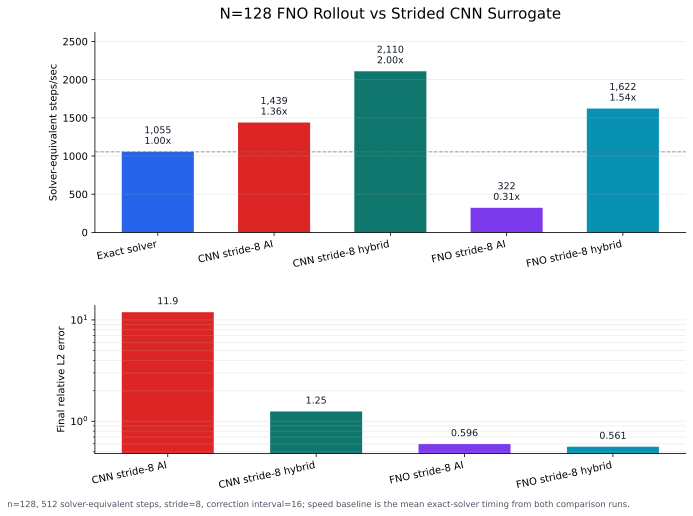

# Fluid AI Sim

This is a starter project for an AI-enabled fluid dynamics simulator. It combines:

- A real 2D incompressible Navier-Stokes solver in vorticity-streamfunction form.
- An explicit velocity-pressure incompressible solver with Fourier projection.
- Torch CNN and FNO surrogates that learn fast rollouts from solver-generated trajectories.
- CLI tools for exact simulation, dataset generation, training, AI rollout, and hybrid rollout.

The first target is periodic 2D flow:

$\frac{d\omega}{dt} + u \frac{d\omega}{dx} + v \frac{d\omega}{dy} = \nu \nabla^2 \omega + \text{forcing}$

$u = \frac{d \psi}{dy}$

$v = -\frac{d \psi}{dx}$ 

$\nabla^2 \psi = -\omega$


This formulation avoids a separate pressure solve and keeps the velocity field divergence-free.

## Quick Start

Run a classical simulation:

```bash
python3 -m fluid_ai_sim.simulate --mode solver --n 64 --steps 200 --out runs/solver_demo
```

Train a tiny surrogate on generated solver data:

```bash
python3 -m fluid_ai_sim.train_surrogate --n 32 --trajectories 12 --steps 40 --epochs 8 --checkpoint runs/surrogate.pt
```

Run the AI surrogate:

```bash
python3 -m fluid_ai_sim.simulate --mode ai --checkpoint runs/surrogate.pt --n 32 --steps 120 --out runs/ai_demo
```

Run a hybrid simulation where the exact solver periodically corrects the AI rollout:

```bash
python3 -m fluid_ai_sim.simulate --mode hybrid --checkpoint runs/surrogate.pt --n 32 --steps 120 --correction-interval 10 --out runs/hybrid_demo
```

Each simulation writes:

- `trajectory.npz`: vorticity fields and diagnostics.
- `diagnostics.json`: human-readable per-step diagnostic values.
- `diagnostics.csv`: tabular diagnostics for quick plotting or spreadsheet import.
- `metadata.json`: run settings and timing.
- `frames/*.ppm`: rendered vorticity snapshots viewable by most image tools.
- `plots/*.png`: vorticity snapshots, energy/enstrophy curves, vorticity range,
  divergence check, and energy spectrum.

Compare exact solver, AI, and hybrid rollouts from the same initial condition:

```bash
python3 -m fluid_ai_sim.compare_modes --checkpoint runs/surrogate.pt --n 32 --steps 120 --out runs/comparison
```

The comparison writes separate `solver`, `ai`, and `hybrid` run folders plus:

- `comparison_metrics.npz` and `comparison_metrics.json`: AI/hybrid error against
  the exact solver.
- `plots/error_to_solver.png`: RMSE and relative L2 drift over time.
- `plots/mode_energy_enstrophy.png`: energy/enstrophy by mode.
- `plots/final_vorticity.png`: final vorticity side-by-side.
- `plots/speed_comparison.png`: solver, AI, and hybrid throughput.

## Incompressible Velocity Solver

This branch also includes a velocity-based periodic incompressible
Navier-Stokes solver:

```text
du/dt + (u . grad)u = -grad p + nu Laplacian u + f
div u = 0
```

Pressure is eliminated with a Fourier-space Leray projection, so both exact
solver steps and AI predictions are projected back to `div u = 0`.

Detailed physics and AI notes:

[Incompressible 2D Navier-Stokes With AI Acceleration](docs/incompressible_navier_stokes_ai.md)

Train a small FNO surrogate on projected velocity fields:

```bash
python -m fluid_ai_sim.train_incompressible_surrogate \
  --model fno \
  --n 32 \
  --trajectories 8 \
  --steps 48 \
  --target-stride 4 \
  --epochs 4 \
  --width 16 \
  --depth 2 \
  --modes 8 \
  --checkpoint runs/incompressible_fno.pt
```

Compare exact, AI, and hybrid incompressible rollouts:

```bash
python -m fluid_ai_sim.compare_incompressible_modes \
  --checkpoint runs/incompressible_fno.pt \
  --use-checkpoint-config \
  --steps 80 \
  --correction-interval 5 \
  --out runs/incompressible_fno_compare
```

## Speed Benchmark



The chart above is a local benchmark using `runs/smoke_surrogate.pt`, 100 rollout
steps, and rendering disabled. Higher steps/sec is better. On this starter model,
the exact spectral solver is still faster than the tiny CNN surrogate at these
grid sizes; the plot makes that tradeoff visible instead of assuming an AI
speedup.

## AI Acceleration Experiment



This branch includes an experimental strided surrogate. Instead of predicting
one solver step per model call, the accelerated checkpoint predicts every 8th
solver step. Throughput is reported as solver-equivalent steps/sec so the solver,
AI, and hybrid modes are comparable. This makes the AI path faster in this run,
but the current smoke-trained model is still too inaccurate for production use.

### 128x128 Run



To rerun the 128x128 acceleration experiment:

```bash
python -m fluid_ai_sim.train_surrogate \
  --n 128 \
  --trajectories 12 \
  --steps 160 \
  --target-stride 8 \
  --epochs 6 \
  --width 16 \
  --depth 2 \
  --kernel-size 3 \
  --residual-scale 0.5 \
  --checkpoint runs/accelerated_stride8_n128.pt

python -m fluid_ai_sim.compare_modes \
  --checkpoint runs/accelerated_stride8_n128.pt \
  --use-checkpoint-config \
  --steps 512 \
  --correction-interval 16 \
  --out runs/accelerated_stride8_n128_compare_ci16 \
  --no-render

python tools/generate_acceleration_experiment_plot.py \
  --run-dir runs/accelerated_stride8_n128_compare_ci16 \
  --out docs/ai_acceleration_stride8_n128.svg
```

### Fourier Neural Operator Rollout

This branch can train either the original local CNN surrogate or a Fourier
Neural Operator. The FNO mixes low-frequency Fourier modes across the whole
periodic field, which is a better match for spectral fluid dynamics than only
local convolutions.

Smoke-tested FNO run:



This first plot is a tiny n=32 smoke test to verify the FNO path end to end.
Use the 128x128 command below for a more meaningful acceleration/accuracy run.

```bash
python -m fluid_ai_sim.train_surrogate \
  --model fno \
  --n 32 \
  --trajectories 4 \
  --steps 24 \
  --target-stride 4 \
  --epochs 2 \
  --width 8 \
  --depth 2 \
  --modes 6 \
  --checkpoint runs/fno_smoke.pt

python -m fluid_ai_sim.compare_modes \
  --checkpoint runs/fno_smoke.pt \
  --use-checkpoint-config \
  --steps 32 \
  --correction-interval 4 \
  --out runs/fno_smoke_compare \
  --no-render \
  --no-plots
```

N=128 FNO-vs-strided-CNN comparison:



This run uses the same stride-8 rollout horizon as the existing CNN surrogate.
The FNO is more accurate in this benchmark, while the small CNN remains faster
per surrogate step.

```bash
python -m fluid_ai_sim.train_surrogate \
  --model fno \
  --n 128 \
  --trajectories 32 \
  --steps 192 \
  --target-stride 8 \
  --epochs 20 \
  --width 24 \
  --depth 3 \
  --modes 16 \
  --residual-scale 0.35 \
  --checkpoint runs/fno_stride8_n128.pt

python -m fluid_ai_sim.compare_modes \
  --checkpoint runs/fno_stride8_n128.pt \
  --use-checkpoint-config \
  --steps 512 \
  --correction-interval 16 \
  --out runs/fno_stride8_n128_compare_ci16 \
  --no-render

python tools/generate_fno_vs_stride_plot.py \
  --stride-run runs/accelerated_stride8_n128_compare_ci16 \
  --fno-run runs/fno_stride8_n128_compare_ci16 \
  --out docs/fno_vs_stride_n128.svg
```

## Architecture

The simulator is deliberately split into three layers:

1. **Truth solvers**:
   - `fluid_ai_sim.solver.SpectralNavierStokes2D`: vorticity-streamfunction form with FFT derivatives.
   - `fluid_ai_sim.incompressible.SpectralIncompressibleNavierStokes2D`: velocity-pressure form with Fourier incompressibility projection.

2. **Learning system**: `fluid_ai_sim.surrogate`
   - Small residual CNN with circular padding.
   - Fourier Neural Operator option with learned spectral mixing.
   - Learns normalized `omega_t -> omega_{t+1}` or `[u_t, v_t] -> [u_{t+s}, v_{t+s}]` transitions.
   - Saves normalization stats in the checkpoint.

3. **Rollout modes**: `fluid_ai_sim.simulate` and `fluid_ai_sim.compare_incompressible_modes`
   - `solver`: exact solver every step.
   - `ai`: learned model every step.
   - `hybrid`: learned model with periodic exact correction.

## Why This Is Useful

Classical CFD is reliable but expensive. Neural rollouts can be much faster once trained, but they drift. The hybrid mode is a practical middle ground: use AI for most steps and periodically re-anchor with the physics solver.

For production or research-grade work, the next upgrades would be:

- Fourier Neural Operator or U-Net surrogate.
- Boundary conditions beyond periodic domains.
- Pressure-velocity formulation for obstacles and walls.
- Physics-informed loss terms for energy, enstrophy, and residual consistency.
- GPU batching for many parameterized flow scenarios.
- Validation against known benchmarks such as Taylor-Green vortex, lid-driven cavity, or cylinder wake.

## Tests

```bash
python3 -m unittest discover -s tests
```
